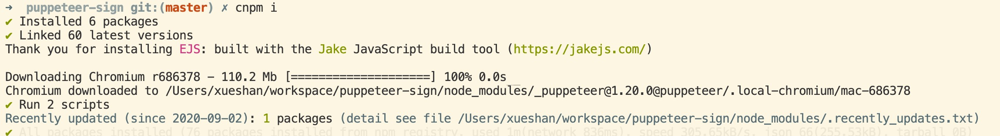
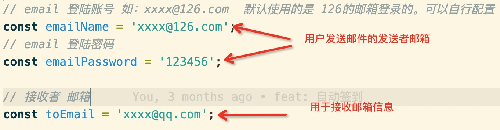
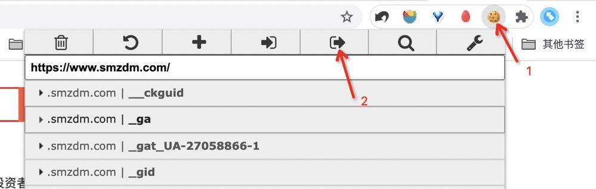
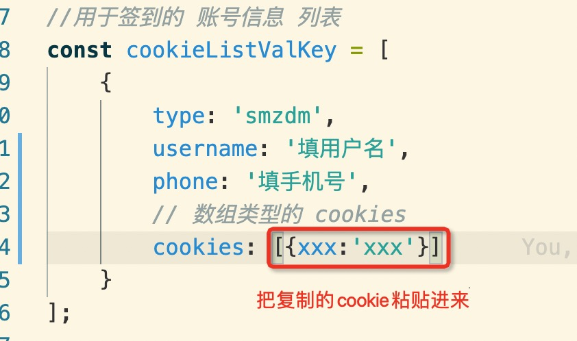

# puppeteer-sign

基于 puppeteer，什么值得买签到，完全模拟人工点击

## 使用方法

### 依赖环境

`nodejs` 最好使用最新稳定版v12  https://nodejs.org/en/download/

### 安装依赖

由于`puppeteer`需要安装软件包，推荐使用国内淘宝镜像安装 
cnpm 安装 `npm i cnpm -g`

```bash
cnpm i
```



### 参数配置

#### 邮箱配置

>默认配置的是126的邮箱登录信息
>
>也可以用其他平台的邮箱，详见`/lib/mail.js` 文件中的说明

打开根目录的 `config.js` 文件，根据下图配置



邮件会发送每天的截图信息，方便查阅。

#### 什么值得买 cookie配置 

依赖 chrome 插件 `editthiscookie` 用来取网站cookie，有梯子的直接应用商店安装即可，没梯子的，可以百度搜搜安装一下。

具体步骤详解
1. 打开 `https://www.smzdm.com/` 官网并登录
2. 点开 `editthiscookie` 插件然后点如下图按钮

3. 把复制的cookie粘贴到下图中



> 支持多个账号

### 执行

> 推荐使用 `pm2` ，具体可以详见 `https://www.jianshu.com/p/e15fd72727fe`

```bash
# 可以用node直接运行
node main

# 通过pm2执行
pm2 start main.js

# 查看运行日志
pm2 log main
```
